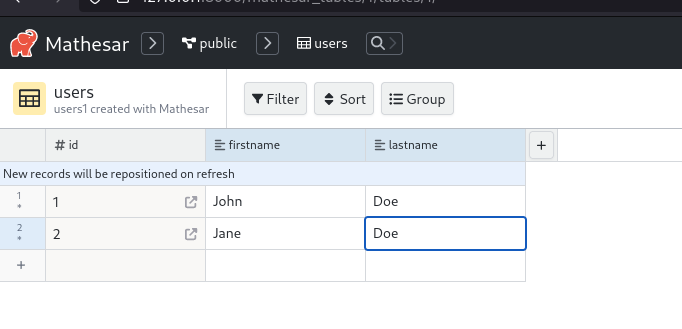

# Mathesar hosting playground

This repository contains a environment that allows to test [Mathesar](https://github.com/centerofci/mathesar/) deployment.

Ressource: [Install Mathesar via Docker Compose](https://docs.mathesar.org/install/docker-compose/)

```
$ docker compose up -d --wait
$ docker compose exec mathesar_service python manage.py createsuperuser --no-input --username admin --email johndoe@example.com
```

Go to http://127.0.0.1:8000

Login / password is `admin` / `password`.

This Mathesar instance works against `postgres` service defined in [`./docker-compose.yml`](./docker-compose.yml).

I create `users` table with some data via Mathesar UI:



This is the result in `postgres` database:

```
$ ./scripts/enter-in-pg.sh
postgres=# \dt+ users
                                            List of relations
 Schema | Name  | Type  |  Owner   | Persistence | Access method |  Size   |         Description
--------+-------+-------+----------+-------------+---------------+---------+------------------------------
 public | users | table | postgres | permanent   | heap          | 0 bytes | users1 created with Mathesar
(1 row)

postgres=# select * from users;
 id | firstname | lastname
----+-----------+----------
  1 | John      | Doe
  2 | Jane      | Doe
(2 rows)
```

Stop:

```sh
$ docker compose down
$ sudo rm -rf volumes/
```
